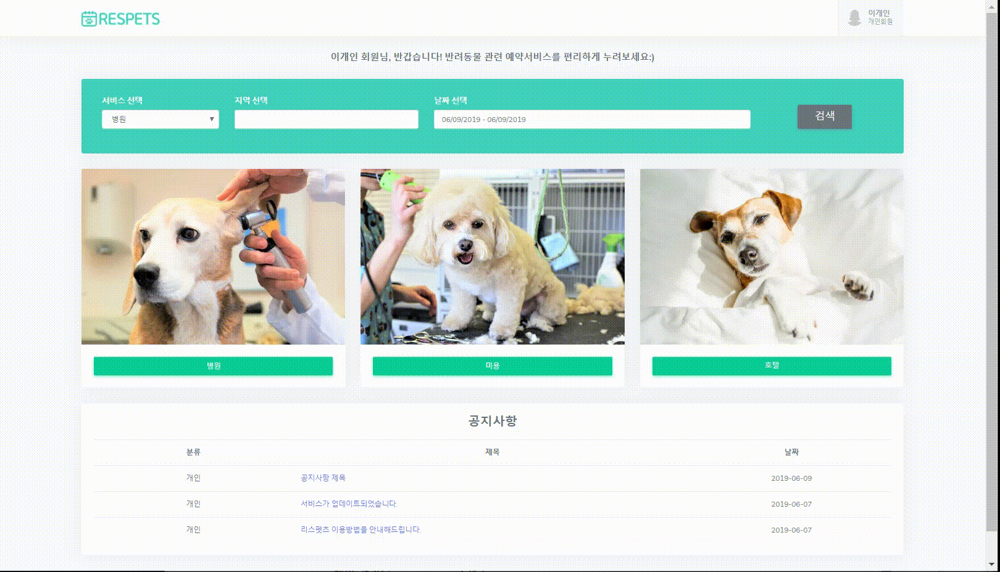

# Respets 프로젝트 소개

반려동물 관련 시장이 성장함에 따라 편리 서비스를 제공하는 웹사이트의 필요성이 커지고 있지만 아직은 양적으로나 질적으로 만족스러운 웹사이트가 부족하다고 느껴져 리스펫츠를 제작했습니다. 리스펫츠는 반려동물과 함께 사는 삶의 지표와 편의를 제공합니다. 이와 연계된 업체는 홍보 및 광고 효과를 누릴 수 있고, 예약 서비스를 통하여 보다 확실한 잠재고객을 확보할 수 있습니다.

#### 환경설정

> - 언어 : JAVA 8
>
> - 프레임워크 : Spring 3.9.6
>
> - 서버 : Apache Tomcat 9.0
>
> - 데이터베이스 : Oracle 11g
>
> - 형상관리 : Git (Sourcetree)
>
> - 운영체제 : Windows10
>
> - 기타기술 : JavaScript/jQuery/Ajax/Bootstrap

#### 규모

> ##### DB
>
> - 테이블: 34개 (총 Column 173개)
> 
> - 사용된 Query 204개
> 
> - 사용된 View 4개
>
> ##### Source
>
> - Controller Class 6개 (총 URL 121개)
> 
> - DTO (Data Transfer Object) Class 10개
> 
> - Service Class 6개
> 
> - DAO (Data Access Object) Class 5개
> 
> - Mapper Class 5개
> 
> - 기타 2개
> 
> - View (JSP File) 73개

#### 주요 역할 및 담당

> 1. UI 설계
>
> 2. 상단바 & 메인 공지사항
>
> 3. 기업 상세
>
> 4. 개인 동물 정보
>
> 5. 개인 캘린더
>
> 6. 관리자 공지사항

#### 1. UI 설계

- 테마 결정 및 부트스트랩 적용

- 팀원들에게 디자인에 대한 부담을 줄여주기 위해 전반적인 레이아웃 구성 및 UI 사용 가이드 제공

- 팀원들과의 소통을 위해 구글 프레젠테이션을 이용해 실시간으로 스토리보드 작성 및 수정

- 스토리보드 바로가기 
https://docs.google.com/presentation/d/1ztzhVSoASep-BAfIiUKH3ZBAkVb8FgGh6kHbj-5WwRw/edit?usp=sharing

  

#### 2. 상단바 & 메인 공지사항

- 상단바
  - 세션에 담긴 회원번호를 확인하여 회원종류(비회원/개인/기업/관리자)를 구분하고 비회원일 경우 로그인/ 회원가입 버튼, 회원일 경우에는 회원정보를 표시(클릭 시 프로필 메뉴는 드롭박스로 구현)
- 메인 공지사항
  - 관리자가 작성한 공지사항의 최근 게시물 3개가 표시되는 기능, 글 제목을 클릭하면 모달박스로 내용 표시
  - 개인회원은 개인 카테고리만, 기업회원은 기업 카테고리만, 관리자는 모든 카테고리가 표시된다.

#### 3. 기업 상세

- 대표사진, 주업종, 기업명, 전체서비스가 최상단에 표시되고, 기본정보/갤러리/공지사항 으로 이루어진 각 탭을 클릭 시 Ajax를 통해 페이지 전환없이 확인할 수 있도록 구현
- Ajax를 통해 자주 이용하는 업체를 등록할 수 있도록 개인회원에게만 노출되는 즐겨찾기 버튼 구현

#### 4. 개인 동물정보

- 목록 - 개인회원이 등록한 모든 동물 표시
- 상세 - 목록에서 선택한 동물의 상세 정보 표시
- 등록/수정/삭제 - 새로운 동물 등록, 기존 동물 수정 및 삭제 기능, 필수입력란 유효성 검사 기능

#### 5. 개인 캘린더

- Full Calendar API를 이용하여 개인 예약 내역을 표시
- JSON형태로 데이터를 받는다. JSON에는 Date형식이 없기 때문에 @DateTimeFormat 어노테이션을 사용하여 구현
- 표시된 일정 클릭 시 모달박스를 이용해 상세 내용 표시

#### 6. 관리자 공지사항

- 목록 - 관리자가 작성한 모든 게시글 목록 표시
- 상세 - 목록에서 선택한 게시글의 상세 내용 표시
- 등록/수정/삭제 - 새로운 게시글 등록, 기존 게시글 수정 및 삭제 기능, 필수입력란 유효성 검사 기능
- 검색 - 텍스트 입력 후 검색 버튼 클릭 시 검색 기능

